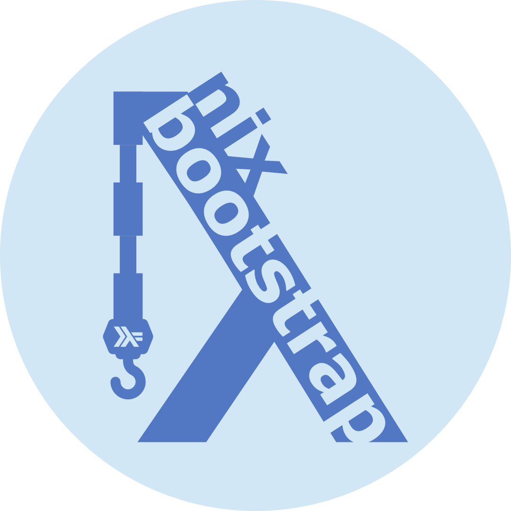

# nix-bootstrap

This project aims to simplify generating the infrastructure
for common types of projects.

## Features

nix-bootstrap provides development infrastructure and pre-commit hooks
as well as some production build configurations.

<details>
<summary>Expand feature tables</summary>
<p>

Existing features and toolchains supported have been decided
based on the needs of the internal developer community within GCHQ.

That said, if there's a toolchain/feature set you'd like that we don't
support, feel free to [contribute it](./CONTRIBUTING.md)!

### Key

The following symbols are used throughout this page to indicate support status:

| Symbol |       Meaning       |
| :----: | :-----------------: |
|   ✅   |   Fully Supported   |
|   🟠   | Partially Supported |
|   🕓   |   Support Planned   |
|   ❌   |    Not Supported    |

### Toolchain Support

|            Toolchain\\\\Feature            |                           Development Environment                           |                               VSCode DevContainer                               | Gitignore | Pre-Commit Hooks[1](#footnote1) |                              Reproducible Production Builds                               |
| :----------------------------------------: | :-------------------------------------------------------------------------: | :-----------------------------------------------------------------------------: | :-------: | :-----------------------------: | :---------------------------------------------------------------------------------------: |
|                    Elm                     | ✅ <br>Either as a standalone app or as part of a Node project with Parcel. |                    ✅ <br>With the Elm extension installed.                     |    ✅     |               ✅                |                                            ❌                                             |
|                   Golang                   |                                     ✅                                      |                ✅ <br>With the official Go extension installed.                 |    ✅     |               ✅                |                  🟠 <br>Support is currently considered _experimental_.                   |
|                  Haskell                   |      ✅ <br>Either as a simple project or just a place to run a repl.       |              ✅ <br>With the haskell.haskell extension installed.               |    ✅     |               ✅                |                                            🕓                                             |
|                    Java                    |      ✅ <br>With maven, google-java-format, and optionally minishift.       | ✅ <br>With the official Java, and optionally the Lombok, extensions installed. |    ✅     |               ✅                | 🟠 <br>Only supports Spring applications. Support is currently considered _experimental_. |
| Minimal (With no project-specific tooling) |                                     ✅                                      |                                       ✅                                        |    ✅     |               🟠                |                                            ❌                                             |
|                   NodeJS                   |     ✅ <br>With latest stable node, AWS CLI, and optionally PNPm/Yarn.      |                                       ✅                                        |    ✅     |               ✅                |                                            ❌                                             |
|                   Python                   |                       ✅ <br>With Python version 3.9                        |                ✅ <br>With the official Python VSCode extension.                |    ✅     |               🟠                |                                            ❌                                             |
|                    Rust                    |                                     ✅                                      |                ✅ <br>With the official rust-analyzer extension.                |    ✅     |               ✅                |                                            ✅                                             |

<a id="footnote1"><sup>1</sup></a> Marked as fully supported if any non-nix pre-commit hooks are added.
See the Pre-Commit Hooks table below for details.

### Pre-Commit Hooks

| Toolchain\\\\Hook Type | Nix Formatting[2](#footnote2) |        Formatters         |          Linters           |    Testing     |
| :--------------------: | :---------------------------: | :-----------------------: | :------------------------: | :------------: |
|          Elm           |              ✅               |     ✅ <br>elm-format     |     ✅ <br>elm-review      |       ❌       |
|         Golang         |              ✅               |       ✅ <br>go-fmt       |             ❌             | ✅ <br>go test |
|        Haskell         |              ✅               |       ✅ <br>ormolu       |        ✅ <br>hlint        |       ❌       |
|          Java          |              ✅               | ✅ <br>google-java-format |             ❌             |       ❌       |
|        Minimal         |              ✅               |            ❌             |             ❌             |       ❌       |
|         NodeJS         |              ✅               |      ✅ <br>prettier      |             ❌             |       ❌       |
|         Python         |              ✅               |            ❌             |             ❌             |       ❌       |
|          Rust          |              ✅               |       ✅<br>rustfmt       | ✅<br>cargo check + clippy |       ❌       |

<a id="footnote2"><sup>2</sup></a> [`alejandra`](https://github.com/kamadorueda/alejandra) is set up to format nix files.

### Continuous Integration

nix-bootstrap provides configurations for GitLab CI out-of-the-box.

|                   Scenario\\\\CI Job                   | Build Development Environment | Run Pre-Commit Hooks | Build For Production |
| :----------------------------------------------------: | :---------------------------: | :------------------: | :------------------: |
|                        Default                         |              ✅               |          ❌          |          ❌          |
|                Pre-Commit Hooks Enabled                |              ✅               |          ✅          |          ❌          |
| Pre-Commit Hooks Disabled, Production Build Configured |              ✅               |          ❌          |          ✅          |
| Pre-Commit Hooks Enabled, Production Build Configured  |              ✅               |          ✅          |          ✅          |

For Elm projects, it provides an additional CI job to build the Elm site.

</p>
</details>

## Installation & Usage

<details>
<summary>Expand installation instructions</summary>
<p>

The simplest way to get started is to run the following script:

```sh
sh <(curl -L https://raw.githubusercontent.com/gchq/nix-bootstrap/main/scripts/run.sh)
```

Or to run nix-bootstrap with flakes enabled:

```sh
sh <(curl -L https://raw.githubusercontent.com/gchq/nix-bootstrap/main/scripts/run.sh) --experimental-use-flakes
```

Alternatively, you can always clone the repo and build nix-bootstrap using `nix build`.
The built binary will then be available in `./result/bin/nix-bootstrap`.

</p>
</details>

## Contributing

We welcome contributions to the project. Detailed information on our ways of working can be found
in [CONTRIBUTING.md](CONTRIBUTING.md).

In brief:

- Sign the [GCHQ Contributor Licence Agreement](https://cla-assistant.io/gchq/nix-bootstrap).
- Submit a pull request.

### Development Environment Setup

<details>
<summary>Expand development environment setup instructions</summary>
<p>

This section is for people who want to contribute to the nix-bootstrap tool.

#### Environment Setup

1. Install [nix](https://nixos.org) by running the following command:

   ```sh
   sh <(curl -L https://nixos.org/nix/install) --daemon
   ```

2. [Enable Nix Flakes](https://nixos.wiki/wiki/flakes#Enable_flakes).
3. Install direnv **>=2.23.0**, by first [installing the direnv package for your system](https://direnv.net/docs/installation.html).

   - You can check your current version by running `direnv version`
   - On the latest Ubuntu, this is available using `apt-get`
   - If you can't install it through your OS's package manager, download a release from the [GitHub releases page](https://github.com/direnv/direnv/releases) and put it somewhere on your `$PATH`.

4. [Hook direnv into your shell](https://direnv.net/docs/hook.html)
5. Clone [the nix-bootstrap repository](https://github.com/gchq/nix-bootstrap)
6. Run `direnv allow` in the cloned directory
7. Run `setUpHaskellLanguageServer` to ensure cabal and the HLS build correctly

#### Building nix-bootstrap with Cabal

You'll probably want to run your builds with Cabal during development as it builds incrementally by module.

1. After a fresh clone, run `setUpHaskellLanguageServer`. This gets around [a bug in Cabal](https://github.com/haskell/cabal/issues/7641).
2. During development, run builds with `cabal build -O0`. The `-O0` (optimisation zero) flag speeds up the compilation
   process at the expense of not optimising the code for quicker run times.
3. You can run tests with `cabal test --test-show-details=streaming -O0`

#### Building nix-bootstrap with Nix

Nix should be used for production builds, as it enables several additional checks.

Run `nix build`. This will produce a production binary at `result/bin/nix-bootstrap`.

**Note:** ^ This command has a space in it, not a dash - this is a change since v1 of the nix CLI.

#### Structure of the nix-bootstrap Repo

The nix-bootstrap source modules are grouped as follows (those without `.hs` extensions are directories):

```plaintext
src/
├── Bootstrap
│   ├── Cli.hs                    - Handling of nix-bootstrap's CLI options and producing its RunConfig from them
│   ├── Data                      - Data structures, including files we bootstrap
│   │   └── Bootstrappable        - All the files we bootstrap
│   │       ├── Go                - Files we bootstrap which are specific to Go projects
│   │       └── Python            - Files we bootstrap which are specific to Python projects
│   ├── Error.hs                  - Error handling helpers
│   ├── Monad.hs                  - Exposes MonadBootstrap, a collection of common constraints required by nix-bootstrap functions
│   ├── Niv.hs                    - Management of dependencies with Niv
│   ├── Nix                       - Handling of writing and structuring Nix Code
│   │   └── Expr                  - A Nix AST and some common expressions formed with it
│   │       └── ReproducibleBuild - Expressions specific to producing reproducible builds
│   ├── State.hs                  - Management of state used for user interactions
│   ├── Terminal                  - Additional helpers for things displayed in the CLI
│   ├── Terminal.hs               - Handles user interactions through the terminal
│   └── Unix.hs                   - Provides an interface for interacting with other CLIs
├── Bootstrap.hs                  - The main nix-bootstrap entrypoint
└── Prelude.hs                    - A custom prelude
```

#### Common Scenarios

##### Adding support for a new toolchain

1. Add a new `ProjectSuperType` and corresponding `ProjectType` to the [`Bootstrap.Data.ProjectType`](./src/Bootstrap/Data/ProjectType.hs) module
2. Run `cabal build -O0`, handling incomplete case statements until all of the warnings are fixed

##### Adding a new file to the list of files to be bootstrapped

1. Add a new module for the file under [`Bootstrap.Data.Bootstrappable`](./src/Bootstrap/Data/Bootstrappable)
2. In the new module:

   1. Create a datatype for the file
   2. Make that datatype an instance of `Bootstrap.Data.Bootstrappable.Bootstrappable`
   3. Add a function which will return `Maybe a` where `a` is your datatype, depending on whether
      it is necessary to bootstrap the file under the given circumstances
   4. Name the function in `2.3` using a suffix of "for" according to the conventions - see
      [`Bootstrap.Data.Bootstrappable.VSCodeSettings`](./src/Bootstrap/Data/Bootstrappable/VSCodeSettings.hs) `vsCodeSettingsFor` for an example.

3. Call the function in `2.3` in the `mkInitialBuildPlanMap` function in the [`Bootstrap`](./src/Bootstrap.hs) module

</p>
</details>

## License

nix-bootstrap is released under the
[Apache 2.0 Licence](https://www.apache.org/licenses/LICENSE-2.0)
and is covered by
[Crown Copyright](https://www.nationalarchives.gov.uk/information-management/re-using-public-sector-information/copyright-and-re-use/crown-copyright/).
